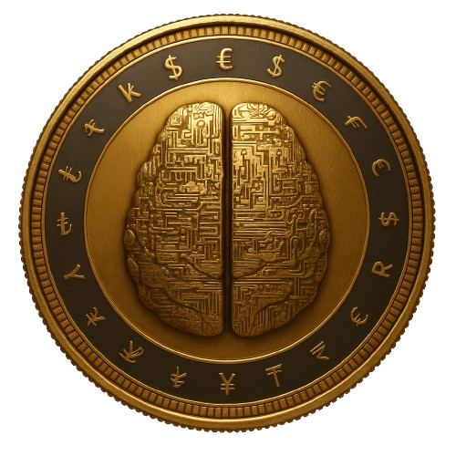

<div align="center">
  


# 🌱 Dr. Chandravesh Chaudhari
Dr. Chandravesh Chaudhari is an Assistant Professor, researcher, and open-source developer focused on building Scientific Intelligence Systems that help people discover, understand, evaluate, and synthesize knowledge at scale.

His work spans Retrieval-Augmented Generation (RAG), Agentic AI, Multimodal Learning, AI Evaluation, and intelligent research workflows, with a particular emphasis on developing reliable and transparent AI systems for scientific discovery and evidence-based decision-making.

He is the creator of LitSynth and Brain-AI, open-source initiatives that explore how retrieval, reasoning, memory, multimodal understanding, and autonomous agents can be combined to support next-generation research assistance.

Through research, software, and education, he aims to bridge the gap between artificial intelligence and human knowledge creation, advancing systems that augment researchers, educators, and organizations in navigating an increasingly complex information landscape.


### *Building a Sustainable Future Through Intelligent Automation*

[](https://chandraveshchaudhari.github.io/website/)
[](https://www.linkedin.com/in/chandraveshchaudhari)
[](mailto:chandraveshchaudhari@gmail.com)

<div style="margin-top: 15px; font-size: 0.9em; color: #00C853;">
  <strong>🌍 Solarpunk Vision</strong> • <strong>🤖 Agentic AI</strong> • <strong>📈 Financial Intelligence</strong> • <strong>🤝 Open Collaboration</strong>
</div>

</div>

---

## 🗺️ Repository Map (Quick Overview)

```mermaid
%%{init: {"theme": "base", "themeVariables": {"primaryTextColor": "#2C3E50", "primaryColor": "#E8F4F8", "primaryBorderColor": "#3498DB", "lineColor": "#3498DB", "secondBkgColor": "#FCE4D6", "secondTextColor": "#C0392B", "tertiaryColor": "#E8F5E9", "tertiaryTextColor": "#1B5E20", "tertiaryBorderColor": "#66BB6A"}}}%%
mindmap
  root((Repositories))
    📚 Books
      Programming_for_Business
      Machine_Learning_For_Business
    🚀 Production & Education Tools
      instantgrade
      Jupyterbook_with_lite_template
      resume_website
    🤖 Core Research & AI Frameworks
      brain-ai (BMMA)
      hybrid-feature-selection
      financial-variable-generation
    📖 Literature-Automation (Next Gen)
      LitSynth
    ⚙️ Helper & Dev Templates
      python-project-template
    🕸 Projects Hub
      Student Projects Hub
````

---

## 📚 Books

| Repository                                                                                                 | Description                                                          |
| ---------------------------------------------------------------------------------------------------------- | -------------------------------------------------------------------- |
| [**Programming_for_Business**](https://github.com/chandraveshchaudhari/Programming_for_Business)           | Code + exercises bridging business operations and Python automation. |
| [**Machine_Learning_For_Business**](https://github.com/chandraveshchaudhari/Machine_Learning_For_Business) | Applied ML techniques geared toward business decision intelligence.  |

---

## 🚀 Projects — What People Can Use Today

### 🔬 Core Research & AI Frameworks

| Project                                                                                                    | Summary                                                                                                                                                           |
| ---------------------------------------------------------------------------------------------------------- | ----------------------------------------------------------------------------------------------------------------------------------------------------------------- |
| [**brain-ai (BMMA)**](https://github.com/chandraveshchaudhari/brain-ai)                                    | A multimodal AutoML framework orchestrating feature-fusion, model search, and adaptive evaluation across heterogeneous data — ideal for research and production.  |
| [**projects/core-research/brain-ai**](projects/core-research/brain-ai) | Local workspace layout for `brain-ai` containing experiment notebooks, adapters, and deployment recipes. |
| [**hybrid-feature-selection**](https://github.com/chandraveshchaudhari/hybrid-feature-selection)           | Hybrid subset selection + importance ranking for explainable ML pipelines. Combines statistical and model-based methods for robust feature curation.              |
| [**financial-variable-generation**](https://github.com/chandraveshchaudhari/financial-variable-generation) | Automated computation of financial ratios and technical indicators from company data and stock history — useful for quantitative finance and analytics pipelines. |
| [**projects/core-research/research_management_system**](projects/core-research/research_management_system) | Research management & RAG system (LitSynth / research-management-system) with ingestion pipelines, provenance tracking, and citation-graph tools for reproducible literature synthesis. |

---

### 🎓 Education, Automation & Book-Support Tools

| Project                                                                                                      | Summary                                                                                                                                                               |
| ------------------------------------------------------------------------------------------------------------ | --------------------------------------------------------------------------------------------------------------------------------------------------------------------- |
| [**instantgrade**](https://github.com/chandraveshchaudhari/instantgrade)                                     | Automated evaluation framework for Python notebooks and Excel assignments — supports education workflows, grading, and feedback generation.                           |
| [**Jupyterbook_with_lite_template (v2)**](https://github.com/chandraveshchaudhari/Jupyterbook_with_lite_template) ([Live demo](https://chandraveshchaudhari.github.io/jupyterbook2_with_lite_template/)) | A unified template (version 2) combining JupyterLite & JupyterBook with inline interpreter + Google Colab launchers — ideal for sharing tutorials, books, or interactive content. |
| [**website**](https://github.com/chandraveshchaudhari/website)                                               | Personal portfolio & academic website repository.                                                                                                                     |

---

## 🧰 Templates & Dev-Starter Kits

<div align="center">

<h3>⚙️ Please Don't Reinvent the Wheel 🛞</h3>

</div>

| Template                                                                                       | Purpose                                                                                               |
| ---------------------------------------------------------------------------------------------- | ----------------------------------------------------------------------------------------------------- |
| [**python-project-template**](https://github.com/chandraveshchaudhari/python-project-template) | Minimal, opinionated Python starter: structure + tooling to begin new projects cleanly.               |
| [**resume_website**](https://github.com/chandraveshchaudhari/resume_website)                   | Personal resume/website generator built with modern UI (TypeScript), for quick online presence setup. |
| [**projects/personal-brand/resume_website**](projects/personal-brand/resume_website)           | Local template and configuration for generating rich resumes and portfolio pages from structured YAML/JSON metadata. |
| [**projects/tools/jupyterbook2_with_lite_template**](projects/tools/jupyterbook2_with_lite_template) | Local JupyterBook + JupyterLite template (v2) with example content, launchers and CI-ready build scripts for distributing interactive books. |

---

## 📖 Literature & Research Automation

| Project                                                          | Status                                                                                               | Description                                                                                                                                              |
| ---------------------------------------------------------------- | ---------------------------------------------------------------------------------------------------- | -------------------------------------------------------------------------------------------------------------------------------------------------------- |
| [**LitSynth**](https://github.com/chandraveshchaudhari/LitSynth) | 🔜 Will supersede [systematic-reviewpy](https://github.com/chandraveshchaudhari/systematic-reviewpy) | RAG + agentic flows for literature triage, synthesis, and citation-graph intelligence — aiming to streamline research workflows and knowledge synthesis. |

---

## 🧠 Upcoming: Student Projects Hub

| Repository                          | Description                                                                                                                                                                     |
| ----------------------------------- | ------------------------------------------------------------------------------------------------------------------------------------------------------------------------------- |
| [**Student_Projects_Hub**](https://github.com/chandraveshchaudhari/Student_Projects_Hub) | Repository for student ML submissions and project assignments. |

---

## ⚡ Active Development (Current GitHub Work)

These are projects I'm actively developing on GitHub — focused on scalable ML systems, reproducible research, and production-ready tooling that bridge research and applied data science.

| Repository | Status & Focus |
| --- | --- |
| [**financial-variable-generation**](https://github.com/chandraveshchaudhari/financial-variable-generation) | Actively expanding dataset pipelines and indicator libraries for quantitative finance research and backtesting. Outputs structured features, handles corporate events, and supports time-aware leakage controls. |
| [**LitSynth**](https://github.com/chandraveshchaudhari/LitSynth) | Rapidly iterating on RAG + agentic flows for literature triage, citation graph extraction, and automated synthesis for systematic reviews. Great for accelerating research workflows. |
| [**resume_website**](https://github.com/chandraveshchaudhari/resume_website) | Ongoing work to improve generated resume content, richer project metadata, and exportable PDF/HTML resume for applied roles. |
| [**brain-ai (BMMA)**](https://github.com/chandraveshchaudhari/brain-ai) | Core repo for multimodal AutoML — adding adapters for new modalities, evaluation suites, and deployment patterns for reproducible experiments. |
| [**instantgrade**](https://github.com/chandraveshchaudhari/instantgrade) | Enhancing automated evaluation for educational artifacts (notebooks, spreadsheets) with feedback generation and rubric-driven scoring. |

> If you want to collaborate, contribute, or request a demo for any of these, open an issue or reach out on LinkedIn/email — I'm prioritizing contributions that push projects toward production-ready research artifacts.


## 📊 Skills, Tech Stack & Expertise

<div align="center">

### Languages & Frameworks


### Specializations


### Research & R&D


</div>

---

## 🤝 Collaboration Entry Points

| Area                                        | Invitation                                                                                                                                                                                                        |
| ------------------------------------------- | ----------------------------------------------------------------------------------------------------------------------------------------------------------------------------------------------------------------- |
| 🔬 **Multimodal AutoML**                    | Contribute new modality adapters or evaluation hooks to [**brain-ai**](https://github.com/chandraveshchaudhari/brain-ai).                                                                                         |
| 🧠 **Explainability & Feature Engineering** | Extend [**hybrid-feature-selection**](https://github.com/chandraveshchaudhari/hybrid-feature-selection) with new heuristics or domain-specific logic.                                                             |
| 📖 **Literature Automation**                | Help design prompts & citation-graph embeddings for [**LitSynth**](https://github.com/chandraveshchaudhari/LitSynth).                                                                                             |
| 📘 **Educational Content & Books**          | Propose business-case examples or contribute chapters to the book repos.                                                                                                                                          |
| 🛠 **Templates & Starters**                 | Suggest workflow improvements for [**python-project-template**](https://github.com/chandraveshchaudhari/python-project-template) or [**resume_website**](https://github.com/chandraveshchaudhari/resume_website). |
| 🧑‍🎓 **Student Projects Hub**              | Mentor or organize contributions for the **Student_Projects_Hub** — see [Student_Projects_Hub](https://github.com/chandraveshchaudhari/Student_Projects_Hub).                                                                                                                                        |

---

## 📈 GitHub Stats

<div align="center">


</div>

---

> *“The best way to predict the future is to build it — but let's make sure it's a future where technology serves humanity and the planet.”*

*Building the future, one commit at a time 🚀🌱*


