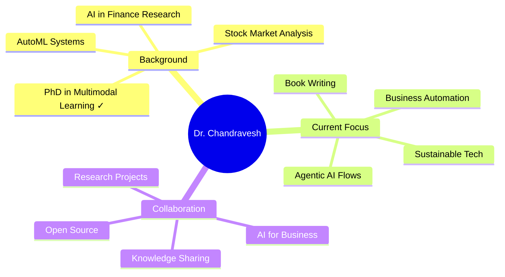

<div align="center">
  
# 🌱 Dr. Chandravesh Chaudhari

### *Building a Sustainable Future Through Intelligent Automation*

[](https://chandraveshchaudhari.github.io/website/)
[](https://www.linkedin.com/in/chandraveshchaudhari)
[](mailto:chandraveshchaudhari@gmail.com)

</div>

---

## 🌿 Philosophy: Code for a Better Tomorrow

I believe in **Solarpunk** — a future where technology and nature coexist harmoniously. My work bridges cutting-edge AI with practical business solutions, always asking: *"How can we automate the mundane to free humans for creative, meaningful work?"*

<div align="center">
  


</div>

---

## 🚀 What I'm Working On

### 🤖 **Agentic AI & Automation**
Designing intelligent workflows that transform tedious business processes into autonomous, efficient systems. The future isn't just AI — it's AI that *acts*.

### 📈 **Financial Intelligence**
Applying multimodal learning research to decode market patterns, building tools that democratize financial insights through AI.

### 📚 **Knowledge Sharing**
Writing books and creating open-source projects to share insights from my PhD research and practical AI implementations.

### 🤝 **Open for Collaboration**
Actively seeking collaborators for research projects, book contributions, and solving real-world business problems with AI.

---

## 🛠️ Tech Stack & Expertise

<div align="center">

### Languages & Frameworks


### Specializations


### Research & Development


</div>

---

## 📊 Featured Projects

<table>
<tr>
<td width="50%">
### 🔬 Core Research & Intelligence

| Project | Summary | Stack | Focus |
|--------|---------|-------|-------|
| 🧠 brain-ai (BMMA) | Multimodal AutoML framework orchestrating feature fusion, model search, and adaptive evaluation for heterogeneous data. | Python • AutoML • Meta-Learning | Multimodal Learning, Research Core |
| 🎯 hybrid-feature-selection | Hybrid subset selection + importance ranking for explainable ML pipelines (statistical + model-based synergy). | Python • ML • Explainability | Feature Selection, Interpretability |
| 📈 financial-variable-generation | Automated generation of financial ratios + technical indicators for equity analytics. | Python • Pandas • NumPy | Quant Finance, Data Enrichment |

### 🎓 Learning, Books & Assessment

| Project | Summary | Role |
|--------|---------|------|
| 📚 Programming_for_Business | Book repository (code + exercises) bridging business operations and Python automation. | Book |
| 📚 Machine_Learning_For_Business | Applied ML for business decision intelligence; instructional repo. | Book |
| 📝 instantgrade | Automated grading of Python notebooks & Excel assignments (rubric + execution + feedback). | EduTech |
| 📖 Jupyterbook_with_lite_template | Unified template: JupyterLite + JupyterBook + inline interpreter + Colab launchers. | Authoring Infra |
| 🧪 (Planned) student-ml-projects | Upcoming curated space for student assignment repos (successor to legacy MachineLearningProjects). | Incoming |

### 📚 Literature & Research Automation

| Project | Summary | Status |
|--------|---------|--------|
| 🔄 systematic-reviewpy | Framework to automate systematic review workflows (to be superseded). | Legacy |
| 🧬 LitSynth (Planned) | RAG + agentic flows for literature triage, synthesis, citation graph intelligence. | Incoming |

### ⚙️ Automation & Agentic Flows

| Project | Summary | Stack |
|--------|---------|-------|
| 🌐 browser-automationpy | Legacy smart browser workflow launcher to reduce repetitive manual steps. | Selenium |
| 🗂 research_management_system | Research artifact organization (papers, notes, tagging). | Python |
| 🧱 python-project-template | Minimal, opinionated Python starter (structure, tooling). | Template |
| 🧾 resume_website | Personal resume/site generator (TypeScript + modern UI). | Template |
| 🕸 website | Main personal site codebase. | TypeScript |

### 🧩 Data & Pipeline Utilities

| Project | Summary | Focus |
|--------|---------|-------|
| 🧪 Data Wrangling Notebooks | Practical notebooks for cleaning, transforming, and structuring messy datasets. | ETL |
| 🔍 HSFSI Framework (hybrid-feature-selection) | (See above) central to explainable feature curation in high-dimensional spaces. | Explainability |

---

## 🗂 Repository Map (Quick Overview)

- Core Research: brain-ai • hybrid-feature-selection • financial-variable-generation  
- Literature Intelligence (Next Gen): LitSynth (planned, replaces systematic-reviewpy)  
- Education & Books: Programming_for_Business • Machine_Learning_For_Business • instantgrade • Jupyterbook_with_lite_template  
- Automation & Agentic: browser-automationpy (legacy) • research_management_system • python-project-template • resume_website  
- Financial Analytics: financial-variable-generation  
- Explainability: hybrid-feature-selection  
- Templates & Starter Kits: python-project-template • resume_website • Jupyterbook_with_lite_template  
- Upcoming Student Hub: student-ml-projects (planned)  

<details>
  <summary>🗄 Archived / Legacy (click to expand)</summary>

  - systematic-reviewpy (will be superseded by LitSynth)
  - browser-automationpy
  - django-graphql-antd-typescript
  - MachineLearningProjects (to be replaced by student-ml-projects)
</details>

---

### 🔁 Evolution Notes

- systematic-reviewpy → LitSynth (RAG + agentic literature synthesis pipeline)
- MachineLearningProjects → student-ml-projects (structured assignment showcase)
- HSFSI name clarified as hybrid-feature-selection for consistency

### 🤝 Collaboration Entry Points

| Area | How to Engage |
|------|---------------|
| Multimodal AutoML | Contribute new modality adapters to brain-ai |
| Explainability | Add novel hybrid heuristics to hybrid-feature-selection |
| Literature Intelligence | Help design agent prompts & citation graph embedding for LitSynth |
| Education | Provide rubric modules or format adapters for instantgrade |
| Books | Propose chapter enhancements / real business cases |
| Templates | Suggest dev workflow improvements (linting, CI presets) |

---

## 📈 GitHub Statistics

<div align="center">
  


</div>

---

## 🎯 Current Mission

```python
class DrChandravesh:
    def __init__(self):
        self.role = "AI Researcher & Automation Architect"
        self.education = "PhD in Multimodal Learning (Completed ✓)"
        self.mission = "Automate mundane business tasks with agentic AI flows"
        self.background = [
            "PhD Research: Multimodal Learning",
            "Financial AI & Stock Markets",
            "AutoML Systems Development",
            "Business Process Automation"
        ]
        self.current_work = [
            "Agentic AI Systems",
            "Writing AI Books",
            "Open Source Projects",
            "Solarpunk Technology"
        ]
    
    def looking_for_collaborators_on(self):
        return {
            "📚 Books": "Co-authoring AI and automation books",
            "🔬 Research": "New research on AI for business problems",
            "💼 Projects": "Any of my existing GitHub projects",
            "🤝 Consulting": "Solving real-world business challenges with AI",
            "🌱 Ideas": "Sustainable tech and Solarpunk initiatives"
        }
    
    def life_philosophy(self):
        return """
        Technology should enhance human creativity, not replace it.
        Automate the mundane. Amplify the meaningful.
        Build for sustainability. Code for tomorrow. 🌱
        """
    
    def contact_me(self):
        return "Let's collaborate! Reach out via email or LinkedIn 👇"

me = DrChandravesh()
print(me.looking_for_collaborators_on())
```

---

## 🌟 Why I Code

> *"The best way to predict the future is to build it — but let's make sure it's a future where technology serves humanity and the planet."*

### 💡 My Journey & Vision
- **🎓 Academic Background:** Completed PhD in Multimodal Learning, researching how different data types work together
- **🤖 Current Mission:** Automate the repetitive to free humans for creative, meaningful work
- **📚 Knowledge Sharing:** Writing books and creating resources to democratize AI knowledge
- **🌱 Sustainable Tech:** Building technology aligned with Solarpunk principles
- **� Collaboration First:** Believing that the best innovations come from working together
- **💼 Business Impact:** Helping organizations solve real problems with practical AI solutions

---

## 🤝 Let's Collaborate!

### 🌟 I'm Actively Looking for Collaborators On:

- 📚 **Book Projects**: Co-authoring books on AI, automation, and machine learning
- 🔬 **Research**: New research initiatives tackling business problems with AI
- 💻 **Open Source**: Contributing to or building upon my GitHub projects
- 🏢 **Business Solutions**: Applying AI to solve real-world business challenges
- 🎓 **Knowledge Sharing**: Workshops, tutorials, and educational content
- 🌱 **Sustainable Tech**: Solarpunk-inspired technology projects

### 💬 Always Excited to Discuss:
- 🤖 Agentic AI and automation strategies
- 📈 AI applications in financial markets
- 🧠 Multimodal learning research and applications
- 🌱 Sustainable technology and Solarpunk ideas
- 💼 Business process automation challenges

<div align="center">

### 📬 Reach Out

[](mailto:chandraveshchaudhari@gmail.com)
[](https://chandraveshchaudhari.github.io/website/)
[](https://www.linkedin.com/in/chandraveshchaudhari)

---

### ⭐ If you find my work interesting, consider starring some repositories!

*Building the future, one commit at a time* 🚀🌱


</div>
